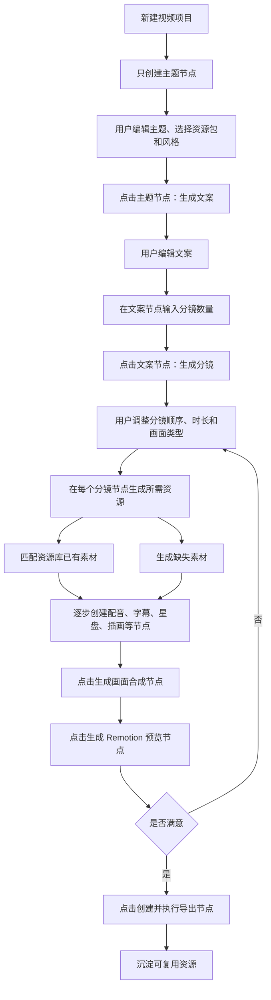

# 占星教学视频生成工具架构

## 1. 项目定位

本项目是一个面向占星教学短视频生产的智能创作工具。它不是传统剪辑软件，也不是单纯的 AI 生成器，而是一个能把「选题、文案、分镜、星盘、插画、配音、字幕、动画预览、视频导出」串起来的生产系统。

核心使用场景：

- 每条视频都有独立主题、独立文案、独立分镜。
- 多条视频共享同一套视觉风格、声音配置、星盘样式、图标素材、片头片尾和场景模板。
- AI 负责生成结构化内容，稳定模板负责渲染成视频。
- 无限画布是主工作台，文案、分镜、字幕、配音、星盘、插画、预览都应是画布上可见、可选中、可调节的对象。
- 画布必须是节点驱动的渐进式生产流程：新项目不能一次性铺满所有节点，只能先出现主题节点；文案、分镜、字幕、配音、素材、预览和导出节点都应由上游节点动作逐步创建。

推荐产品形态是本地优先的 Web 创作工具：

- 用 Web UI 承载无限画布、分镜编辑、素材库、模板库和视频预览。
- 用本地或云端后端执行 AI 调用、TTS、星历计算、素材生成和视频渲染任务。
- 后续如果需要桌面体验，可以用 Tauri 或 Electron 包装同一套 Web 应用。

## 2. 核心模型

### 2.1 独立视频项目

每条视频都是一个独立的 `VideoProject`。它拥有自己的：

- 主题
- 文案
- 分镜
- 旁白音频
- 字幕
- 视频规格
- 导出结果

第一条视频和第二条视频不应该直接继承内容。占星教学的每条视频往往讲不同知识点，因此内容应重新生成。

### 2.2 共享资源库

多条视频之间真正复用的是资源和风格，而不是完整内容。共享资源库包括：

- 十二星座符号
- 行星符号
- 宫位标签
- 星盘 SVG 样式
- 常用背景
- 片头片尾
- BGM 和音效
- TTS 声音配置
- 字幕样式
- 品牌色和字体
- 常用简笔画
- 常用占星概念图

### 2.3 场景模板库

很多占星教学视频虽然主题不同，但表达结构会重复。可以沉淀成模板：

- 概念解释模板
- 对比讲解模板
- 星盘拆解模板
- 三点总结模板
- 案例分析模板
- 时间线讲解模板
- 相位关系讲解模板
- 行星落宫讲解模板

第二条视频不是复制第一条视频，而是选择同一套资源包和模板，再生成新的内容。

### 2.4 无限画布工作台

无限画布不是装饰层，而是产品的核心交互界面。画布上展示的对象必须是用户能理解、能检查、能调节的生产单元。

画布状态必须反映真实生产进度，而不是预先画好的完整流程图。初始画布只包含当前已经存在、可编辑、可执行的节点。下游节点由用户在上游节点上点击生成动作后创建：

- `TopicNode` 点击生成文案后，才出现 `ScriptNode`。
- 用户修改 `ScriptNode` 后，点击生成分镜，才出现对应数量的 `SceneNode` 或可选的 `StoryboardNode`。
- 每个 `SceneNode` 根据需要分别生成 `CaptionNode`、`VoiceNode`、`ChartNode`、`ImageNode`、`D3Node` 或 `ThreeNode`。
- 只有当可渲染场景和资源准备好后，才创建 `CompositionNode`、`PreviewNode` 和 `ExportNode`。

因此，完整流程图可以作为 demo 或模板预览，但不能作为新建项目的默认画布。

画布节点建议包括：

- `TopicNode`：主题节点，展示选题、目标时长、受众、语气和生成文案入口。
- `ScriptNode`：文案节点，展示标题、旁白正文、目标时长、语气。
- `StoryboardNode`：分镜计划节点，展示分镜数量、结构、节奏。
- `SceneNode`：单个分镜节点，展示画面类型、旁白、时长、转场。
- `CaptionNode`：字幕节点，展示字幕文本、位置、字号、颜色、入场方式。
- `VoiceNode`：配音节点，展示音色、语速、情绪、音量、音频文件。
- `ChartNode`：星盘节点，展示星盘类型、宫位系统、需要高亮的行星/宫位/相位。
- `ImageNode`：插画或简笔画节点，展示提示词、风格、生成结果、重生成入口。
- `MusicNode`：BGM 或音效节点，展示音频、音量、淡入淡出。
- `CompositionNode`：画面合成节点，展示某个分镜最终画面预览和可调参数。
- `ExportNode`：导出节点，展示比例、分辨率、帧率、导出状态。

这些节点之间通过流程边连接。典型顺序是：

```txt
主题
--点击生成文案--> 文案
--用户修改文案并点击生成分镜--> 自定义数量的分镜
--逐个分镜点击生成资源--> 字幕 / 配音 / 星盘 / 插画 / D3 / Three
--资源准备完成后点击合成--> 单镜画面合成
--点击预览--> 整条视频预览
--点击导出--> 导出
```

用户应能在画布上直接做这些调整：

- 调整分镜数量
- 调整单个分镜时长
- 调整字幕高低、字号、颜色和动画
- 调整配音音色、语速、音量和情绪
- 替换或重生成某个分镜的插画
- 切换星盘样式和高亮目标
- 替换 BGM 或修改淡入淡出
- 对单个节点局部重生成，而不是整条视频重来

## 3. 生产流程



## 4. 第一条视频和第二条视频的衔接

### 4.1 第一条视频

第一条视频从空资源库或默认资源包开始：

```txt
输入主题
-> 选择默认占星教学风格
-> 生成文案
-> 生成分镜
-> 生成星盘、插画、TTS、字幕
-> 预览
-> 导出
-> 把可复用资源沉淀进资源库
```

第一条视频完成后，系统应保留两类结果：

- 当前视频结果：文案、分镜、音频、字幕、导出 MP4。
- 可复用结果：风格、声音、片头、星盘样式、图标、模板、常用插画。

### 4.2 第二条视频

第二条视频不继承第一条视频文案，而是从资源库开始：

```txt
输入新主题
-> 选择已有资源包
-> 选择已有风格和场景模板
-> 生成全新文案
-> 生成全新分镜
-> 自动匹配可复用素材
-> 只生成缺失素材
-> 预览
-> 导出
-> 继续沉淀新资源
```

这样可以保证内容独立，同时保持系列账号的视觉一致性和生产效率。

## 5. 资源分类

### 5.1 永久复用资源

适合长期保存在全局资源库：

- 十二星座符号
- 行星符号
- 宫位数字和标签
- 星盘基础样式
- 字幕样式
- 品牌字体
- 片头片尾
- BGM
- TTS voice profile
- 常用转场

### 5.2 半复用资源

适合按主题、标签或模板复用：

- 上升星座概念图
- 水逆概念图
- 相位关系示意图
- 太阳/月亮/上升对比图
- 星盘高亮动画
- Three.js 星体空间场景
- D3 知识关系图模板

### 5.3 单条视频独有资源

默认只属于当前视频：

- 当前视频文案
- 当前视频分镜
- 当前旁白音频
- 当前字幕文件
- 当前具体星盘数据
- 当前导出 MP4
- 为某一幕单独生成的插图

单条视频资源可以被用户手动标记为「加入资源库」。

## 6. 系统模块

### 6.1 Web 创作界面

负责用户可见的创作体验：

- 项目列表
- 新建视频向导
- 无限画布主工作台
- 文案节点编辑
- 分镜节点编辑
- 字幕位置和样式调节
- 配音参数调节
- 素材节点管理
- 模板选择
- 风格预设选择
- 预览和导出状态

### 6.2 资源库

负责管理可复用资产：

- 素材上传
- AI 生成素材入库
- 标签和分类
- 资源包
- 使用次数
- 授权信息
- 是否允许自动复用

### 6.3 模板库

负责管理可复用表达结构：

- 场景模板
- 视频结构模板
- 标题卡模板
- 星盘讲解模板
- 总结模板
- 转场模板

模板不保存某条视频的具体文案，只保存结构和渲染规则。

### 6.4 AI 生成服务

负责生成结构化内容：

- 选题扩写
- 教程大纲
- 旁白文案
- 分镜脚本
- 素材需求
- 图片提示词
- TTS 风格建议

AI 输出必须经过 schema 校验后才能进入项目数据。

### 6.5 占星计算与星盘服务

负责专业占星能力：

- 出生盘、行运盘、合盘等计算
- 行星位置
- 宫位
- 相位
- 星盘 SVG 数据
- 星盘高亮目标
- 占星解释辅助信息

星历计算和星盘绘制应分离，方便替换工具或接入专业 API。

### 6.6 资源生成服务

负责把分镜中的素材需求变成真实文件：

- 星盘 SVG
- AI 图片
- TTS 音频
- 字幕文件
- 背景音乐或音效
- 中间缓存文件

每个资源都应有状态：`pending`、`generating`、`ready`、`failed`。

### 6.7 视频渲染服务

负责把视频项目编译成可预览、可导出的结果：

- Remotion Composition
- 场景组件选择
- 时间轴计算
- 音频轨道合成
- 字幕叠加
- MP4 导出

## 7. 推荐技术栈

### 7.1 前端

- Next.js / React
- TypeScript
- tldraw：无限画布
- React Flow：可选，用于节点式任务流
- Zustand：状态管理
- Radix UI / shadcn/ui：界面组件

### 7.2 视频与动画

- Remotion：主视频预览与导出
- GSAP：转场、手绘标注、文字动效
- Three.js / React Three Fiber：3D 星体、黄道空间、轨道动画
- D3：知识树、关系图、时间线、能量分布图
- FFmpeg：音视频处理

### 7.3 占星与 AI

- astrodraw/astrochart：星盘 SVG 绘制
- Swiss Ephemeris 或兼容服务：星历计算
- LLM：文案和分镜
- Image Generation：简笔画和视觉素材
- TTS：旁白音频
- ASR / forced alignment：字幕对齐，可后续加入

## 8. 核心数据结构草案

```ts
type VideoProject = {
  id: string;
  title: string;
  topic: string;
  status: "draft" | "generating" | "ready" | "exported";
  spec: AstroVideoSpec;
  canvas: CanvasDocument;
  assetRefs: ProjectAssetRef[];
  createdAt: string;
  updatedAt: string;
};

type AstroVideoSpec = {
  version: "1";
  title: string;
  format: "landscape" | "portrait" | "square";
  fps: number;
  stylePresetId?: string;
  templateId?: string;
  scenes: SceneSpec[];
  audio?: AudioSpec;
};

type LibraryAsset = {
  id: string;
  name: string;
  kind:
    | "zodiac-symbol"
    | "planet-symbol"
    | "chart-style"
    | "intro"
    | "outro"
    | "bgm"
    | "voice-profile"
    | "scene-template"
    | "illustration"
    | "svg"
    | "image"
    | "audio";
  path?: string;
  tags: string[];
  reusable: boolean;
  metadata: Record<string, unknown>;
  createdAt: string;
  updatedAt: string;
};

type ProjectAssetRef = {
  assetId: string;
  source: "library" | "project";
  usage: "intro" | "outro" | "scene" | "narration" | "chart" | "background" | "sfx";
  sceneId?: string;
};

type CanvasDocument = {
  version: "1";
  nodes: CanvasNode[];
  edges: CanvasEdge[];
  viewport?: {
    x: number;
    y: number;
    zoom: number;
  };
};

type CanvasNode = {
  id: string;
  kind:
    | "topic"
    | "script"
    | "storyboard"
    | "scene"
    | "caption"
    | "voice"
    | "chart"
    | "image"
    | "music"
    | "composition"
    | "preview"
    | "export";
  refId?: string;
  position: { x: number; y: number };
  size?: { width: number; height: number };
  data: Record<string, unknown>;
};

type CanvasEdge = {
  id: string;
  fromNodeId: string;
  toNodeId: string;
  relation: "produces" | "uses" | "renders" | "depends-on";
};

type SceneSpec =
  | TextSceneSpec
  | AstroChartSceneSpec
  | SketchSceneSpec
  | D3DiagramSceneSpec
  | ThreeSceneSpec;
```

## 9. 场景类型

建议第一阶段支持：

- `text`：标题卡、重点句、总结卡
- `astro-chart`：星盘展示、高亮行星/宫位/相位
- `sketch`：AI 简笔画或概念图
- `d3-diagram`：关系图、时间线、知识树
- `three-scene`：星体空间、行星轨道、镜头穿梭

每个场景类型对应一个稳定渲染器。AI 只生成场景参数，不直接生成渲染代码。

## 10. MVP 范围

第一版建议只做 30 到 60 秒短视频闭环，但必须以无限画布为主界面。MVP 的画布可以很克制，不追求复杂白板能力，但所有核心生产物都要在画布上可见、可点选、可调节。

1. 新建视频项目
2. 在画布上创建主题节点
3. 选择默认占星教学资源包
4. 生成文案节点
5. 用户输入或调整分镜数量
6. 生成 3 到 5 个分镜节点
7. 为每个分镜生成资源需求节点
8. 复用默认片头、字幕样式、星盘样式
9. 生成 TTS、字幕和画面合成节点
10. 用 Remotion 预览
11. 导出 MP4
12. 把可复用素材加入资源库

## 11. 后续迭代路线

### 阶段 1：画布基础闭环

- 视频项目
- 无限画布
- 文案节点
- 分镜节点
- 素材节点
- 本地资源库
- Remotion 预览
- MP4 导出

### 阶段 2：资源复用

- 资源包
- 风格预设
- 模板库
- 自动匹配可复用素材
- 手动入库

### 阶段 3：画布增强

- 任务状态节点
- 局部重生成
- 节点连线
- 多分支方案
- 画布版本历史

### 阶段 4：专业占星

- 星历计算
- 星盘 SVG
- 行星、宫位、相位高亮
- 占星解释模板

### 阶段 5：高级视觉

- Three.js 星体空间
- D3 关系图和时间线
- GSAP 手绘标注
- 多套视频模板

### 阶段 6：桌面化与批量生产

- Tauri/Electron 桌面壳
- 本地项目文件
- 批量生成
- 资源包导入导出
- 多平台比例导出

## 12. 主要风险

### 12.1 内容复用边界

占星教学视频的内容不能机械继承上一条视频。系统应复用资源和模板，而不是复用上一条视频的文案和分镜。

### 12.2 星历准确性

星盘准确性受出生时间、地点、时区、夏令时、宫位系统影响。星历计算模块必须独立，并保存原始输入和计算结果。

### 12.3 AI 输出不可控

AI 输出必须结构化并经过 schema 校验。缺字段、类型错误或逻辑不完整时，应重试或进入人工编辑。

### 12.4 生成耗时

TTS、图片生成和视频渲染都可能较慢，需要任务状态、缓存、失败重试和局部重新生成。

### 12.5 授权问题

Remotion、Swiss Ephemeris、字体、素材、AI 生成服务都可能涉及授权。商业化前需要逐项确认。
