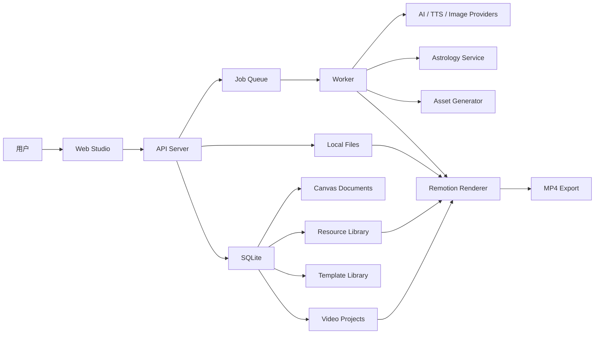
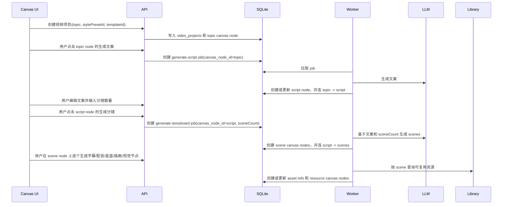
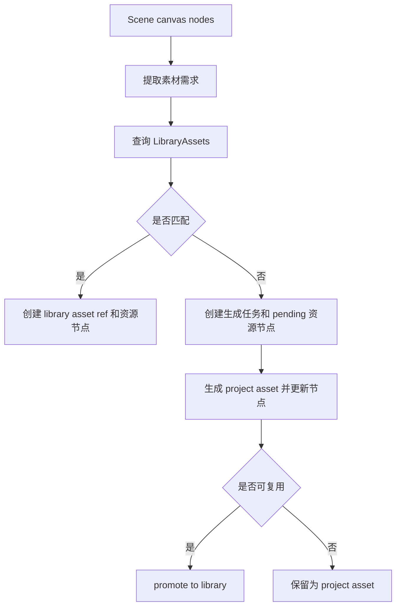

# 技术架构设计

## 1. 总体技术路线

本项目采用「本地优先 Web 应用 + 后端任务服务 + 共享资源库 + Remotion 渲染包 + 插件式场景渲染器」的架构。

核心工程目标：

- 每条视频是独立 `VideoProject`。
- 无限画布是主编辑模型，每个关键生产物都对应可见可调的 `CanvasNode`。
- `CanvasDocument` 必须按生产进度渐进扩展：新项目 seed 只创建 `topic` 节点，其他节点由对应 job 在用户触发后创建或更新。
- 公共素材、风格、声音、模板进入 `Library`。
- AI 生成结构化数据，不直接生成不可控视频代码。
- Remotion 根据 `AstroVideoSpec` 和资源引用稳定渲染视频。
- D3、Three.js、astrochart、AI 图片等能力通过 scene renderer 插件扩展。



## 2. 运行单元

MVP 阶段建议保留三个运行单元：

```txt
1. apps/web
   - Next.js Web UI
   - API Routes
   - 无限画布
   - 项目管理
   - 资源库管理
   - 预览和导出入口

2. apps/worker
   - 长任务执行
   - AI 文案/分镜生成
   - TTS 生成
   - 图片生成
   - 星盘生成
   - 视频导出

3. packages/remotion-video
   - Remotion Composition
   - 场景渲染
   - 时间轴
   - 音频和字幕
```

后续桌面化时，可以用 Tauri 或 Electron 包装：

```txt
Desktop App
  WebView: apps/web
  Sidecar: apps/worker
  Local Data: data/projects, data/library, data/exports
```

## 3. Monorepo 结构

```txt
zeroflow/
  apps/
    web/
      app/
        api/
        projects/
        library/
        templates/
        studio/
      components/
      features/
        project/
        storyboard/
        canvas/
        assets/
        library/
        templates/
        preview/
        export/

    worker/
      src/
        index.ts
        jobs/
        queues/
        runners/

  packages/
    core/
      src/
        schema/
        project/
        canvas/
        library/
        templates/
        jobs/
        ids/
        errors/

    db/
      src/
        client.ts
        schema.ts
        migrations/

    providers/
      src/
        llm/
        image/
        tts/
        astrology/

    astro/
      src/
        ephemeris/
        chart/
        interpretation/

    renderers/
      src/
        registry.ts
        text/
        astro-chart/
        sketch/
        d3-diagram/
        three-scene/

    remotion-video/
      src/
        Root.tsx
        compositions/
        timeline/
        audio/
        captions/

  data/
    projects/
    library/
    exports/
    cache/

  docs/
```

## 4. 包职责

### 4.1 `packages/core`

共享业务类型和 schema。

负责：

- `VideoProject`
- `CanvasDocument`
- `CanvasNode`
- `AstroVideoSpec`
- `SceneSpec`
- `LibraryAsset`
- `SceneTemplate`
- `StylePreset`
- `Job`
- Zod schema
- ID 生成
- 错误类型

这个包不能依赖 UI、数据库、AI SDK 或 Remotion。

### 4.2 `packages/db`

数据库访问层。

负责：

- SQLite client
- 表结构
- migrations
- repository
- transaction helper

MVP 推荐 SQLite + Drizzle。后续如果要多人协作或云端部署，可迁移 PostgreSQL。

### 4.3 `packages/providers`

外部能力适配层。

负责：

- LLM provider
- Image generation provider
- TTS provider
- Astrology provider
- provider 错误归一化
- 重试和限流策略

业务代码只调用统一接口，不直接散落具体厂商 SDK。

### 4.4 `packages/astro`

占星专业能力包。

负责：

- 出生盘、行运盘、合盘等计算
- 行星、宫位、相位结构化数据
- 星盘绘制输入数据
- 星盘解释辅助

星历计算和 SVG 绘制要分层，避免将来替换工具时牵动视频系统。

### 4.5 `packages/renderers`

场景渲染插件包。

负责：

- scene type 到 React renderer 的注册
- scene 数据校验
- scene 依赖资源声明
- D3、Three.js、星盘、插画等画面能力扩展

### 4.6 `packages/remotion-video`

视频工程包。

负责：

- Remotion Root
- Composition 定义
- 时间轴计算
- 字幕层
- 音频轨道
- 视频导出参数

它只读取项目 spec 和 asset refs，不负责 AI 生成。

### 4.7 `apps/web`

创作界面和 API。

负责：

- 新建视频
- 无限画布主工作台
- 项目编辑
- 文案节点编辑
- 分镜节点编辑
- 字幕位置和样式调节
- 配音参数调节
- 素材节点管理
- 资源库管理
- 模板库管理
- 预览入口
- 导出入口
- 任务状态展示

### 4.8 `apps/worker`

后台任务执行器。

负责：

- 拉取 pending jobs
- 调用 providers
- 生成和写入 assets
- 更新 job 状态
- 触发 Remotion render
- 失败重试

## 5. 数据模型

### 5.1 项目表

```txt
video_projects
  id
  title
  topic
  status
  spec_json
  canvas_json
  created_at
  updated_at
```

`spec_json` 是渲染契约，给 Remotion 使用。`canvas_json` 是编辑契约，保存画布节点、连线、位置、尺寸和视口。二者都属于项目数据，但不能混成一个东西。

### 5.2 项目资源表

项目资源默认只属于某条视频。

```txt
project_assets
  id
  project_id
  kind
  source
  status
  path
  metadata_json
  created_at
  updated_at
```

### 5.3 资源库表

资源库资产可以被多条视频复用。

```txt
library_assets
  id
  name
  kind
  status
  path
  tags_json
  reusable
  license_json
  metadata_json
  usage_count
  created_at
  updated_at
```

### 5.4 项目资源引用表

同一条视频可以引用项目独有资源，也可以引用资源库资产。

```txt
project_asset_refs
  id
  project_id
  scene_id
  canvas_node_id
  asset_id
  asset_scope
  usage
  created_at
```

`asset_scope` 可取：

```txt
project
library
```

### 5.5 模板和风格

```txt
scene_templates
  id
  name
  kind
  schema_json
  default_spec_json
  tags_json
  created_at
  updated_at

style_presets
  id
  name
  tokens_json
  caption_style_json
  chart_style_json
  motion_style_json
  created_at
  updated_at
```

### 5.6 任务和导出

```txt
jobs
  id
  project_id
  canvas_node_id
  type
  status
  input_json
  output_json
  error_json
  created_at
  updated_at

exports
  id
  project_id
  status
  format
  path
  settings_json
  created_at
  updated_at
```

## 6. 文件存储

```txt
data/
  projects/
    {projectId}/
      project.json
      assets/
        chart/
        image/
        audio/
        subtitle/
      exports/

  library/
    symbols/
    chart-styles/
    intros/
    outros/
    bgm/
    voices/
    illustrations/
    templates/

  cache/
    providers/
    renders/

  exports/
```

数据库保存元数据和引用关系，大文件保存在文件系统。

## 7. 核心数据结构

```ts
type VideoProject = {
  id: string;
  title: string;
  topic: string;
  status: "draft" | "generating" | "ready" | "exported";
  spec: AstroVideoSpec;
  canvas: CanvasDocument;
  assetRefs: ProjectAssetRef[];
  createdAt: string;
  updatedAt: string;
};

type AstroVideoSpec = {
  version: "1";
  title: string;
  format: "portrait" | "landscape" | "square";
  fps: number;
  stylePresetId?: string;
  templateId?: string;
  scenes: SceneSpec[];
  audio?: AudioSpec;
};

type LibraryAsset = {
  id: string;
  name: string;
  kind: LibraryAssetKind;
  path?: string;
  tags: string[];
  reusable: boolean;
  license?: LicenseInfo;
  metadata: Record<string, unknown>;
  usageCount: number;
};

type ProjectAssetRef = {
  assetId: string;
  assetScope: "project" | "library";
  usage: "intro" | "outro" | "scene" | "narration" | "chart" | "background" | "sfx";
  sceneId?: string;
  canvasNodeId?: string;
};

type CanvasDocument = {
  version: "1";
  nodes: CanvasNode[];
  edges: CanvasEdge[];
  viewport: {
    x: number;
    y: number;
    zoom: number;
  };
};

type CanvasNode = {
  id: string;
  kind: CanvasNodeKind;
  refId?: string;
  position: { x: number; y: number };
  size: { width: number; height: number };
  status?: "idle" | "generating" | "ready" | "failed";
  data: Record<string, unknown>;
};

type CanvasNodeKind =
  | "topic"
  | "script"
  | "storyboard"
  | "scene"
  | "caption"
  | "voice"
  | "chart"
  | "image"
  | "music"
  | "composition"
  | "preview"
  | "export";

type CanvasEdge = {
  id: string;
  fromNodeId: string;
  toNodeId: string;
  relation: "produces" | "uses" | "renders" | "depends-on";
};
```

## 8. Job 类型

```ts
type JobType =
  | "generate-script"
  | "generate-storyboard"
  | "resolve-assets"
  | "generate-chart"
  | "generate-image"
  | "generate-tts"
  | "align-captions"
  | "render-preview"
  | "render-video"
  | "promote-asset-to-library";

type JobStatus =
  | "pending"
  | "running"
  | "succeeded"
  | "failed"
  | "cancelled";
```

MVP 可以先用 SQLite 任务表 + worker 轮询。后续再升级到 BullMQ。

## 9. 新建视频流程

新建项目不能把完整生产图一次性写入 `canvas_json`。默认 seed 只写入 `VideoProject`、`CanvasDocument.viewport` 和一个 `topic` 节点。之后每个 job 遵循同一条规则：

```txt
if target downstream node exists:
  update target node data/status/asset refs
else:
  create downstream node near source node
  create edge from source node to downstream node
```

这意味着 `generate-script` 由 `topic` 节点触发并创建/更新 `script` 节点；`generate-storyboard` 由 `script` 节点触发并创建 `scene` 节点；字幕、配音、星盘、插画、D3、Three 等资源节点由具体 `scene` 节点触发创建；预览和导出节点只有在可渲染内容存在后才出现。完整样例画布只能作为 demo/template preview，不能作为新项目默认 seed。



画布和 spec 的同步规则：

- 画布节点位置、尺寸、连线只写入 `canvas_json`。
- 画布节点是否存在代表生产对象是否已经创建；不能用隐藏字段模拟一个尚未出现的下游节点。
- job runner 必须以 `canvas_node_id` 作为上游来源定位生成动作，创建下游节点时同时创建流程边。
- 文案正文、分镜顺序、场景时长、字幕位置、配音参数、资源引用写入 `spec_json` 或 `project_asset_refs`。
- 用户在画布上调节字幕高低，本质是更新对应 scene 的 caption layout 参数。
- 用户在画布上调节配音音量，本质是更新 audio track 或 voice asset metadata。
- 用户拖拽分镜顺序，本质是更新 `spec.scenes` 的顺序，并同步画布连线。

## 10. 资源复用流程

`resolve-assets` 任务负责判断哪些素材可以复用，哪些需要新生成。



匹配依据可以包括：

- `kind`
- `tags`
- `stylePresetId`
- `templateId`
- `usage`
- `license`
- `metadata`

## 11. 第一条视频和第二条视频的工程衔接

### 11.1 第一条视频

```txt
create project
-> create topic node
-> generate script
-> create script node
-> generate storyboard
-> create scene nodes
-> resolve assets
-> create resource nodes
-> generate missing assets
-> compose scene nodes
-> render video
-> user marks reusable assets
-> promote selected assets to library
```

第一条视频的独有数据留在 `video_projects` 和 `project_assets`。可复用数据进入 `library_assets`、`scene_templates` 或 `style_presets`。

### 11.2 第二条视频

```txt
create new project
-> select style preset / resource pack / template
-> create topic node
-> generate new script
-> create script node
-> generate new storyboard
-> create scene nodes
-> resolve assets from library
-> create reusable asset refs and nodes
-> generate only missing assets
-> render video
-> update library usage_count
```

第二条视频不会读取第一条完整 spec，只读取公共库中的资源和模板。

## 12. API 设计

### 12.1 项目 API

```txt
GET    /api/projects
POST   /api/projects
GET    /api/projects/:id
PATCH  /api/projects/:id
DELETE /api/projects/:id

POST   /api/projects/:id/generate-script
POST   /api/projects/:id/generate-storyboard
POST   /api/projects/:id/resolve-assets
POST   /api/projects/:id/generate-assets
POST   /api/projects/:id/render-preview
POST   /api/projects/:id/export

GET    /api/projects/:id/canvas
PATCH  /api/projects/:id/canvas
PATCH  /api/projects/:id/canvas/nodes/:nodeId
POST   /api/projects/:id/canvas/nodes/:nodeId/run
```

### 12.2 资源库 API

```txt
GET    /api/library/assets
POST   /api/library/assets
GET    /api/library/assets/:id
PATCH  /api/library/assets/:id
DELETE /api/library/assets/:id

POST   /api/projects/:id/assets/:assetId/promote
```

### 12.3 模板和风格 API

```txt
GET    /api/templates
POST   /api/templates
GET    /api/style-presets
POST   /api/style-presets
```

### 12.4 任务 API

```txt
GET    /api/jobs/:id
POST   /api/jobs/:id/retry
POST   /api/jobs/:id/cancel
```

MVP 可以轮询 job 状态，后续再加 SSE 或 WebSocket。

## 13. Scene Renderer 注册

```ts
export const sceneRendererRegistry = {
  text: TextScene,
  "astro-chart": AstroChartScene,
  sketch: SketchScene,
  "d3-diagram": D3DiagramScene,
  "three-scene": ThreeScene,
} satisfies Record<SceneSpec["type"], React.ComponentType<SceneRendererProps>>;
```

Remotion 根组件只做三件事：

1. 读取 `AstroVideoSpec`
2. 根据 `durationSec` 计算时间轴
3. 调用对应 scene renderer

新增 D3、Three.js、Lottie、星盘样式时，优先新增 renderer，而不是改主时间轴。

## 14. Remotion 时间轴

```ts
const fps = spec.fps;
let cursor = 0;

for (const scene of spec.scenes) {
  const durationFrames = Math.round(scene.durationSec * fps);
  timeline.push({
    scene,
    from: cursor,
    durationFrames,
  });
  cursor += durationFrames;
}
```

主 Composition 负责场景排布。每个 scene renderer 负责自己的内部动画。

音频轨道建议分为：

- narration：TTS 旁白
- music：BGM
- sfx：音效

字幕 MVP 可以先按 scene 粒度生成，后续再做词级对齐。

## 15. AI 输出校验

所有 AI 结果都必须经过 Zod schema 校验。

推荐流程：

```txt
LLM raw response
-> parse JSON
-> schema validate
-> normalize
-> save draft
-> user edit
-> save final spec
```

不要让 AI 直接写 Remotion 组件代码。AI 只生成：

- 文案
- 分镜
- 场景类型
- 素材需求
- 镜头意图
- 图片提示词
- TTS 风格参数
- 画布节点建议布局

## 16. 错误处理

错误类型建议分为：

- 用户可修复：缺少 API key、主题过短、出生时间缺失、地点不明确
- 系统可重试：网络失败、限流、TTS 临时失败、图片生成超时
- 不可恢复：schema 错误、资源文件丢失、渲染崩溃

每个 job 应保存：

- 原始输入
- 错误类型
- 错误摘要
- 用户提示
- 是否可重试

## 17. 开发顺序

### 阶段 1：基础工程骨架

- 初始化 pnpm monorepo
- 创建 `apps/web`
- 创建 `packages/core`
- 定义 `VideoProject`、`CanvasDocument`、`AstroVideoSpec`、`LibraryAsset`
- 用静态 JSON 渲染 Remotion 视频

### 阶段 2：画布和项目模型

- SQLite schema
- 项目 CRUD
- tldraw 画布
- topic/script/storyboard/scene/resource 基础节点
- 画布保存和恢复
- 画布节点与 `AstroVideoSpec` 同步

### 阶段 3：资源库

- 资源库 CRUD
- 项目资源引用
- 默认占星资源包

### 阶段 4：视频生成闭环

- 画布分镜节点编辑
- 3 个 scene renderer：text、astro-chart mock、sketch mock
- TTS mock 或本地音频
- Remotion 预览
- MP4 导出

### 阶段 5：AI 生成

- LLM provider
- generate-script job
- generate-storyboard job
- 支持自定义分镜数量
- Zod 校验
- 用户确认和编辑

### 阶段 6：资源复用

- resolve-assets job
- 自动匹配 library assets
- 缺失素材生成
- 项目素材入库
- usage_count

### 阶段 7：高级画布和视觉

- 字幕位置可视化调节
- 配音参数可视化调节
- 单节点局部重生成
- Three.js scene renderer
- D3 scene renderer
- 星盘高亮动画

## 18. MVP 验收标准

MVP 完成时应满足：

- 可以创建一条新视频
- 可以在无限画布上看到主题、文案、分镜、资源、预览和导出节点
- 可以选择默认资源包和风格
- 可以保存 `AstroVideoSpec`
- 可以保存和恢复 `CanvasDocument`
- 可以管理基础资源库
- 可以生成或手写自定义数量的分镜
- 可以在画布上调节字幕位置和配音参数
- 可以用 Remotion 预览
- 可以导出 MP4
- 可以把某个项目素材标记为可复用并加入资源库
- 第二条视频可以复用第一条沉淀的资源，而不是复制第一条内容
